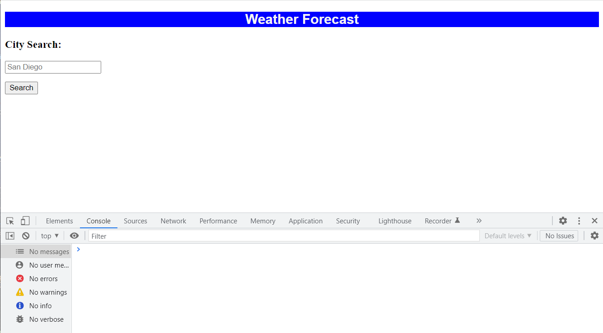

Challenge 06 - Weather Forecast App README
For this assignment, I created a weather forecasting application that allows the user to search for a city to forecast the weather at given location. Search results are saved in local storage and populated under the search box/button. Moment.js is used to get the current day and time, as well as the OpenWeather API we were given (https://openweathermap.org/) to get the current weather and 5 day forecast.

Screenshot of Application

Link to deployed application: https://margotcooper.github.io/Weather-Forecast/

Grading Criteria:
Technical Acceptance Criteria: 40%
Satisfies all of the above acceptance criteria plus the following:

Uses the OpenWeather API to retrieve weather data

Uses localStorage to store persistent data

Deployment: 32%
Application deployed at live URL

Application loads with no errors

Application GitHub URL submitted

GitHub repository that contains application code

Application Quality: 15%
Application user experience is intuitive and easy to navigate

Application user interface style is clean and polished

Application resembles the mock-up functionality provided in the Challenge instructions

Repository Quality: 13%
Repository has a unique name

Repository follows best practices for file structure and naming conventions

Repository follows best practices for class/id naming conventions, indentation, quality comments, etc.

Repository contains multiple descriptive commit messages

Repository contains a quality README file with description, screenshot, and link to deployed application
